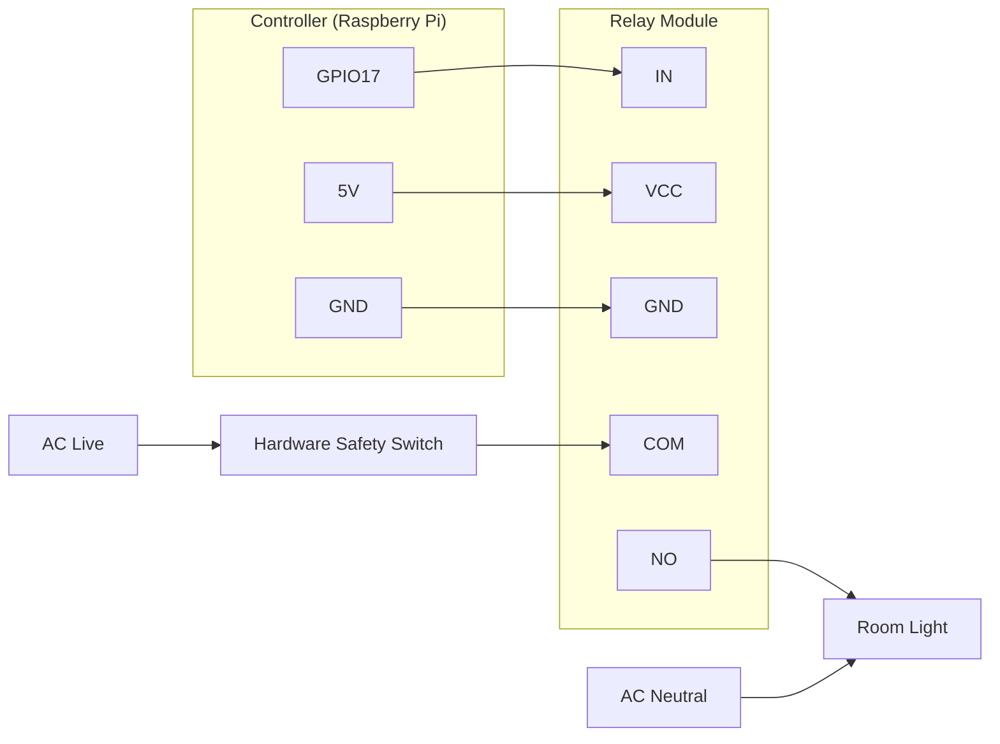

# RoomLight-IoT

A simple IoT-based local light control system using a Raspberry Pi, Flask, and a relay module.

This project hosts a minimal web interface on a Raspberry Pi that allows a user to switch a room light ON and OFF over a local network.

## Features

- Local web interface
- Raspberry Pi GPIO control
- Relay-based AC switching
- Lightweight Flask backend
- Intranet-only operation
- Simple and minimal design

## Hardware Used

- Raspberry Pi 4 Model B
- 1-Channel Relay Module (250V 10A)
- Wi-Fi Router / Local Network
- AC Light Connection

## Software Stack

- Python 3
- Flask
- gpiozero

## circuit diagram

